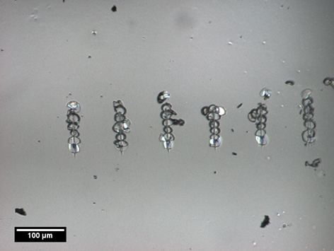
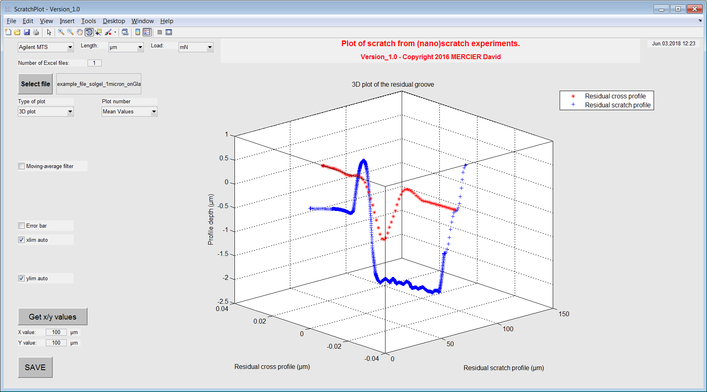

ScratchPlot
=========
This Matlab toolbox has been developed to plot and to analyze scratch resistance and mechanical deformation of material from (nano)scratch results .

To get started with the ScratchPlot toolbox, clone the repository, then run Matlab, and cd into the folder containing this README file.

You can start the launcher by typing "demo" at the Matlab command prompt.

Features
--------

The ScratchPlot toolbox has been developed to plot and to analyze (nano)scratch dataset.

With this Matlab toolbox, it is possible:

    * to load .xls file with scratch results
	* to plot 2D scratch profiles as a function of horizontal displacement;
	* to plot 2D scratch profiles as a function of applied normal load;
    * to plot pre- and post-profiles (or initial and residual topographies);
	* to plot cross profile
    * to get statistical values (min, mean and max).

Matlab version
------------------
Developed with Matlab R2014a.

Author
----------
Written by D. Mercier [1] (david.mercier@crmgroup.be / david9684@gmail.com).

[1] CRM Group, 4000 Liège, Belgium (`www.crmgroup.be <www.crmgroup.be>`_)

Reference papers
------------------

* `Mercier D. et al., "Mechanical characterization by nanoindentation of an electroplated nickel matrix composite coating" (2017). <http://dx.doi.org/10.1051/mattech/2017014>`_

Keywords
---------
Matlab toolbox; GUI;nanoscratch; scratch resistance; groove; pre-scratch; residual scratch; cross profile; critical load.

Acknowledgements
-----------------

Screenshots
-------------

   
   *Scratch performed on a 1300nm thick sol gel coating on a glass substrate.*
   

   
   *ScratchPlot GUI with a 3D plot of residual scratch profiles.*